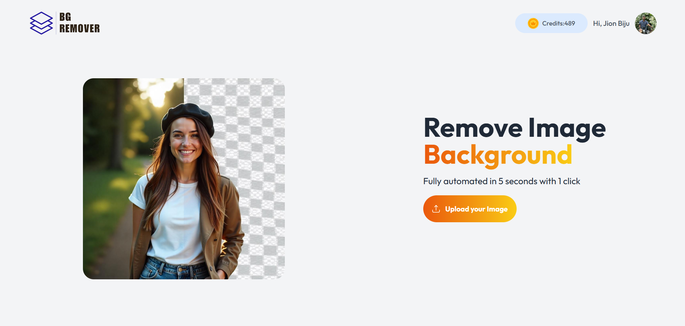
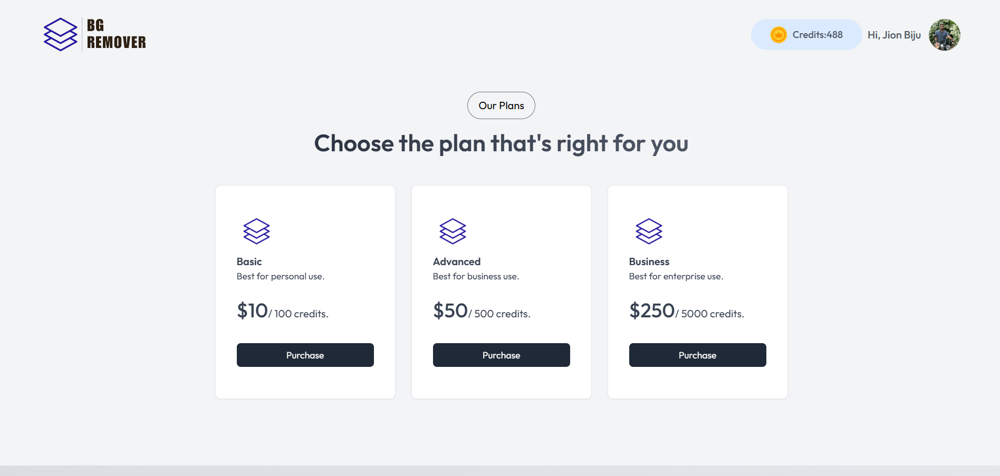

# 🖼️ Background Remover

A full-stack **MERN** application to easily remove the background from images.  
It features **user authentication via Clerk**, a **credit-based system** for image processing, and a **Razorpay-powered payment gateway** for purchasing credits. Styled beautifully with **Tailwind CSS**.

---

## 🌐 Live Demo  
🚀 **[Try it here](https://background-remover-xfv7.vercel.app)**  

---

## 🚀 Features

- **Background Removal** – Upload any image and get a background-free result in seconds.
- **User Authentication** – Secure sign-in and sign-up with [Clerk](https://clerk.com).
- **Credit System** – Each background removal costs credits.
- **Buy Credits** – Integrated [Razorpay](https://razorpay.com) payment gateway to purchase credits.
- **Responsive UI** – Styled with Tailwind CSS for a modern look on all devices.
- **Fullstack MERN** – Built using MongoDB, Express, React, and Node.js.

---

## 🛠️ Tech Stack

**Frontend:**
- React
- Tailwind CSS
- Clerk Authentication

**Backend:**
- Node.js
- Express.js
- MongoDB (Mongoose ODM)

**Others:**
- Razorpay Payment Gateway
- Background Removal API / Library

---

## 📸 Screenshots  

### 🏠 Dashboard  
  

### 📤 Upload & Remove Background  
  

### 💳 Buy Credits  
  

---

## 📦 Installation

1. **Clone the repository**
   ```bash
   git clone https://github.com/jionbiju/background_remover.git
   cd background_remover
